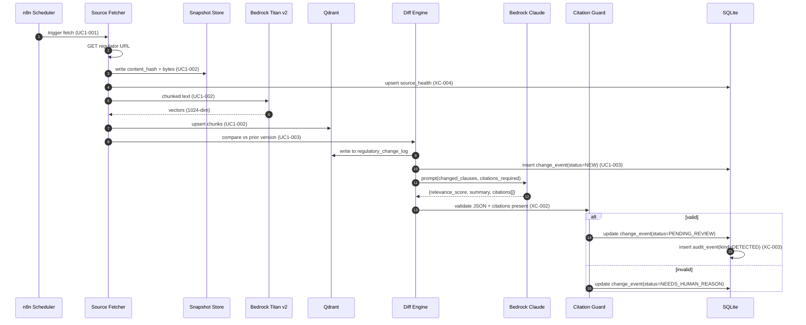
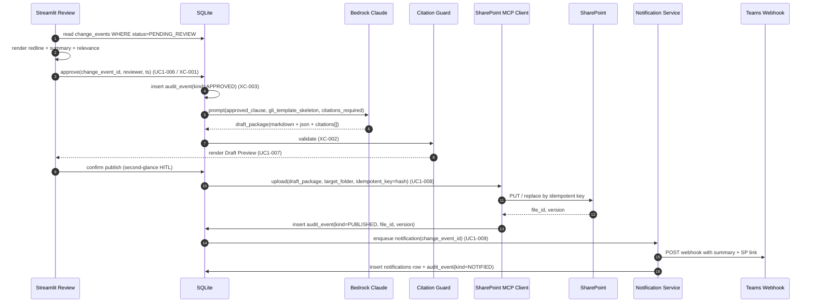
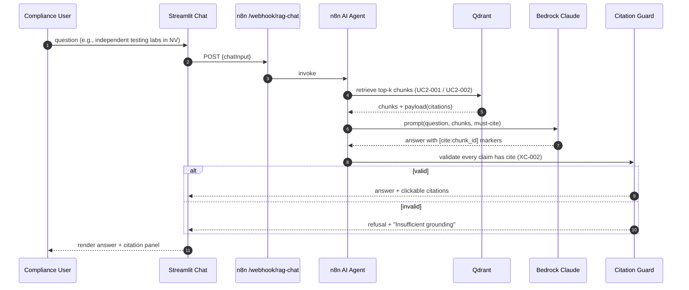

# Low-Level Technical Architecture — GLI Regulatory Change Monitor POC

| Field | Value |
| --- | --- |
| **Audience** | Tech (build), Business (system-level confidence), Sales (talk-track) |
| **Version** | 1.2 |
| **Last updated** | Sunday, May 10, 2026 |
| **Workspace root** | `research/` — **self-contained**. The POC is built from scratch under this folder. This document depends on **no files outside `research/`**. |
| **Source of scope** | [`refined_client_requirement.md`](refined_client_requirement.md) (UC1/UC2/UC3 + XC, Day 1–3 plan, demo script) |
| **Source of feature catalog** | [`refined_client_requirement_features.csv`](refined_client_requirement_features.csv) (every component below cites a `feature_id` from this file) |
| **Inspirational research** | [`regology_research.md`](regology_research.md) (referenced for patterns only) |
| **Companion files** | [`poc_low_level_architecture.csv`](poc_low_level_architecture.csv) (component inventory mirror) · [`migrations/001_init.sql`](migrations/001_init.sql) (canonical DDL for §4.1) |

> **Design rule.** Every component below must trace to at least one `feature_id`. The POC is **built from scratch under `research/`** — there is no dependency on any pre-existing repo file. New services are added only when no service already in the planned stack can deliver the feature.

> **Workspace layout.** Everything the POC needs ships (or will be shipped by Tech) under `research/`:
>
> ```text
> research/
>   refined_client_requirement.md             <- scope + Day 1–3 plan
>   refined_client_requirement_features.csv   <- feature_id catalog
>   regology_research.md                      <- patterns reference
>   poc_low_level_architecture.md             <- this file
>   poc_low_level_architecture.csv            <- component mirror of §1
>   migrations/
>     001_init.sql                            <- §4.1 canonical DDL (shipped)
>   infra/
>     docker-compose.yml                      <- Tech ships in Day-1 step 2 (template inline in §6)
>   .env.example                              <- Tech ships in Day-1 step 2 (template inline in §5)
>   n8n/
>     workflows/                              <- Tech exports flows here (Day-1 step 6)
>   ui/
>     app.py + run.sh + requirements.txt      <- Tech builds in Day-1 step 8
>   seeds/
>     baseline/<jurisdiction>/                <- Tech places ground-truth docs (Day-1 step 7)
>     simulated/<jurisdiction>/                <- Tech places amended copies (Day-1 step 7)
>     uc3_bills.csv                           <- UC3 horizon seed (Day-1 step 7)
> ```
>
> The host machine only needs **Docker** and **Python 3.11+**. No other repo files are referenced.

---

## Table of contents

1. [Component inventory](#1-component-inventory)
2. [Primary low-level diagram (UC1)](#2-primary-low-level-diagram-uc1)
3. [Sequence diagrams](#3-sequence-diagrams)
4. [Data model sketch](#4-data-model-sketch)
5. [Configuration & secrets surface](#5-configuration--secrets-surface)
6. [Day-1 boot checklist](#6-day-1-boot-checklist)
7. [Failure, retry, and observability notes](#7-failure-retry-and-observability-notes)
8. [Open technical decisions](#8-open-technical-decisions)
9. [Glossary & references](#9-glossary--references)

---

## 1. Component inventory

| Component | Role | Proposed tool/tech | Why this choice (1 line) | feature_ids served | Priority |
| --- | --- | --- | --- | --- | --- |
| **Scheduler / Orchestrator** | Cron-driven pipeline runs, branching, retries, HTTP I/O | **n8n** (container in `research/infra/docker-compose.yml`; flows authored in n8n UI and exported to `research/n8n/workflows/`) | Visual flows, native Bedrock + HTTP nodes, fast to wire in 2–3 days | UC1-001, UC1-003, UC1-005, UC1-007, UC1-008, UC1-009, UC1-010, UC3-003 (stretch) | must |
| **Source Fetcher** | Pull regulator HTML/PDF, hash, persist snapshot | **n8n HTTP Download** + Python helper inside n8n `Code` node | Single tool for fetch + hash + write; no extra service | UC1-001, UC1-002 | must |
| **Snapshot Store** | Immutable raw bytes per fetch | **Named Docker volume** `n8n_data` (declared in `research/infra/docker-compose.yml`); content-hash filenames | No external object store needed for laptop POC | UC1-002, XC-003 | must |
| **Vector Store** | Chunk embeddings, retrieval, payload metadata | **Qdrant** (container in `research/infra/docker-compose.yml`) — collections `regulatory_docs` (1024-dim Cosine) and `regulatory_change_log` | Matches Bedrock Titan v2 vector size; provisioned via Day-1 boot | UC1-002, UC1-003, UC2-001, UC2-002, UC2-003 | must |
| **Embedding Model** | Text → 1024-dim vectors | **AWS Bedrock Titan Text Embeddings v2** | Auth surface lives in `research/.env` (`N8N_AWS_*`); same surface used by reasoning model | UC1-002, UC1-003, UC2-001, UC2-002 | must |
| **Diff Engine** | Vector-flag changed chunks + render readable redline | **n8n `Code` node** (chunk-level vector flag) **+ `diff-match-patch`** (word-level redline in Streamlit) | Smallest dependency surface that produces a believable redline UI | UC1-003, UC1-004 | must / should |
| **LLM Reasoning Service** | Relevance scoring, plain-English summary, draft updates, Q&A, citation enforcement | **AWS Bedrock Claude (or equivalent on Bedrock)** via n8n HTTP node | Same auth surface as embeddings; structured JSON outputs supported | UC1-005, UC1-007, UC1-010 (stretch), UC2-002, XC-002 | must / should |
| **Relational Store (state + audit)** | `change_events`, `audit_events`, `source_health`, `bills`, `notifications` | **SQLite** (file in `n8n_data` volume; canonical DDL [`migrations/001_init.sql`](migrations/001_init.sql)) for POC; **Postgres** as roadmap | Zero new container; works with both n8n `Code` node and Streamlit; trivial to upgrade | UC1-002, UC1-006, UC1-008, UC3-001, UC3-002, XC-003, XC-004 | must |
| **Reviewer UI** | Review queue, redline view, draft preview, approve/dismiss, horizon list, Q&A | **Streamlit** app shipped under `research/ui/` with tabs `Review`, `Draft Preview`, `Horizon`, `Health`, `Chat` | Single Python app, single port, no JS toolchain; reads SQLite + Qdrant directly | UC1-004, UC1-006, UC1-007, UC2-002, UC3-001, UC3-002, XC-004 | must |
| **Drafting Module** | Build GLIAccess-aligned package (requirements / templates / tests / docs) with citations | **n8n `Code` node + Bedrock prompt template** producing Markdown sections + JSON payload | Keeps prompt versioning visible; renders cleanly in Streamlit and on SharePoint | UC1-007, XC-002 | should |
| **SharePoint Publisher** | Idempotent upload of approved package | **MCP SharePoint server** invoked from n8n via HTTP (or Python subprocess) | Avoids custom Microsoft Graph plumbing for POC; matches research direction | UC1-008 | must |
| **Notification Service** | Teams + email alerts to staff/operators/regulators | **n8n Teams Incoming Webhook** + **SMTP via Mailhog** (optional Mailhog service in `research/infra/docker-compose.yml`) | Both demo-able offline; webhook drop-in matches enterprise pattern | UC1-009 | should |
| **Localization Hook** *(stretch)* | EN→ES toggle on notifications, locked static spans | **Bedrock Claude prompt** with span-mask dictionary | Demonstrates path without blocking spine | UC1-010 | stretch |
| **RAG Q&A (UC2)** | Cited natural-language answers over corpus | **n8n AI Agent + Qdrant retrieval tool** (named `regulatory_documents_search` in the Day-1 flow) with citation-enforcing system prompt | One workflow covers retrieval + prompt + guard; no extra service | UC2-001, UC2-002, UC2-003 | should |
| **Horizon Tab (UC3)** | Backlog of upcoming bills/proposals | **Streamlit tab + SQLite `bills` table** | Manual seed acceptable per `refined_client_requirement.md` §5 | UC3-001, UC3-002 | must / should |
| **Audit Trail (XC-003)** | Append-only events for every step | **SQLite `audit_events` table** + JSONL mirror in `n8n_data/audit/` | Survives container restart; export endpoint for demo | XC-003 | should |
| **Source-Health Monitor (XC-004)** | Per-source last_success, http_code, parse_rate, hash | **SQLite `source_health` table** + Streamlit dashboard | Cheap insurance; closes "silent scraper failure" risk | XC-004 | should |
| **Citation Guard (XC-002)** | Refuse / flag any LLM output without citation IDs | **Prompt template + JSON-schema validation in n8n `Code` node** | Hard enforcement at the boundary, not the UI | XC-002, UC1-005, UC1-007, UC2-002 | must |
| **HITL Gate (XC-001)** | No SharePoint or stakeholder push without `Approved` state | **State check in n8n branch + UI button gating** | Same pattern Regology uses; non-negotiable for regulated industry | XC-001 | must |

> **Stretch items** (`UC1-010`, `UC2-003`, `UC3-003`) are kept in scope on the diagram as **dashed** edges so the team can drop them last under time pressure.

---

## 2. Primary low-level diagram (UC1)

This is the **single source of truth for UC1**. Every node maps 1:1 to a row in the [Component inventory](#1-component-inventory). Edge labels carry the `feature_id`(s) the edge realizes.

```mermaid
flowchart LR
    subgraph external [External Systems]
        regSites["Regulator Sources<br/>NV gaming.nv.gov + NY portal"]
        sharePoint["SharePoint<br/>(GLIAccess folder)"]
        teamsHook["Teams Incoming Webhook"]
        smtp["SMTP / Mailhog"]
        bedrock["AWS Bedrock<br/>Titan v2 + Claude"]
    end

    subgraph ingestion [Ingestion]
        sched["n8n Scheduler<br/>cron per source"]
        fetcher["Source Fetcher<br/>HTTP Download + hash"]
        snap["Snapshot Store<br/>local volume"]
    end

    subgraph detection [Detection]
        chunker["Chunker + Embedder<br/>Bedrock Titan v2"]
        qdrant[("Qdrant<br/>regulatory_docs")]
        diffEngine["Diff Engine<br/>vector flag + diff-match-patch"]
        chgLog[("Qdrant<br/>regulatory_change_log")]
    end

    subgraph triage [AI Triage]
        relevance["Relevance Scorer<br/>Bedrock Claude (JSON)"]
        citeGuard{{"Citation Guard<br/>schema validate (XC-002)"}}
    end

    subgraph state [State + Audit]
        sqlite[("SQLite<br/>change_events / audit_events / source_health / bills / notifications")]
    end

    subgraph hitl [HITL Review]
        reviewUI["Streamlit Review Inbox<br/>Approve / Dismiss"]
        gate{{"HITL Gate<br/>status == Approved (XC-001)"}}
    end

    subgraph draft [Drafting]
        drafter["Draft Generator<br/>Bedrock Claude + template"]
        draftPreview["Streamlit Draft Preview<br/>redline vs SharePoint sample"]
    end

    subgraph publish [Publish]
        mcpClient["SharePoint MCP Client<br/>idempotent upload"]
    end

    subgraph notify [Notify]
        notifier["Notification Service<br/>n8n Teams + SMTP nodes"]
        i18n["Localization Hook<br/>(stretch)"]
    end

    subgraph qa [UC2 Q&A]
        ragAgent["n8n AI Agent<br/>Qdrant retrieval tool"]
        chatUI["Streamlit Chat tab"]
    end

    subgraph horizon [UC3 Horizon]
        horizonUI["Streamlit Horizon tab"]
        billSeed["Manual Bill Seed Form"]
    end

    subgraph obs [Observability]
        healthUI["Source-Health Dashboard"]
        auditExport["Audit Export"]
    end

    regSites -->|"UC1-001"| sched
    sched -->|"UC1-001"| fetcher
    fetcher -->|"UC1-002"| snap
    fetcher -->|"UC1-002"| chunker
    chunker -->|"UC1-002 / UC1-003"| qdrant
    chunker -->|"UC1-003"| diffEngine
    qdrant -->|"prior chunks"| diffEngine
    diffEngine -->|"UC1-003 / UC1-004"| chgLog
    diffEngine -->|"UC1-003"| sqlite
    chgLog -->|"UC1-005"| relevance
    relevance -->|"UC1-005 + XC-002"| citeGuard
    citeGuard -->|"valid"| sqlite
    sqlite -->|"UC1-006"| reviewUI
    reviewUI -->|"UC1-006 + XC-001"| gate
    gate -->|"UC1-007"| drafter
    drafter -->|"UC1-007 + XC-002"| citeGuard
    drafter -->|"UC1-007"| draftPreview
    draftPreview -->|"UC1-006 second glance"| gate
    gate -->|"UC1-008"| mcpClient
    mcpClient -->|"UC1-008"| sharePoint
    gate -->|"UC1-009"| notifier
    notifier -->|"UC1-009"| teamsHook
    notifier -->|"UC1-009"| smtp
    notifier -.->|"UC1-010 (stretch)"| i18n
    i18n -.->|"UC1-010"| teamsHook

    chunker -->|"UC2-001"| qdrant
    chatUI -->|"UC2-002"| ragAgent
    ragAgent -->|"UC2-002 + XC-002"| qdrant
    ragAgent -->|"UC2-002 + XC-002"| citeGuard

    billSeed -->|"UC3-002"| sqlite
    sqlite -->|"UC3-001"| horizonUI

    fetcher -->|"XC-004"| sqlite
    sqlite -->|"XC-004"| healthUI
    sqlite -->|"XC-003"| auditExport

    relevance -.- bedrock
    drafter -.- bedrock
    chunker -.- bedrock
    ragAgent -.- bedrock
```



**Reading guide.**

- **Solid edges** = must-have flows for the demo.
- **Dashed edges** (`-.->` and `-.-`) = stretch features and "talks to LLM provider" annotations (kept dashed to avoid implying user-visible latency at the demo).
- The two **gates** (`citeGuard`, `gate`) are explicit per the constraint: *HITL (XC-001) and mandatory citations (XC-002) must be visible in the diagrams as explicit gates*.

---

## 3. Sequence diagrams

### 3.1 Detect → Diff → Relevance (Day 1–2)



### 3.2 HITL approve → Draft → SharePoint MCP push (Day 2–3)



### 3.3 UC2 cited Q&A (Day 3 thin slice)



---

## 4. Data model sketch

### 4.1 SQLite (file: `n8n_data/state.db`)

> **Canonical DDL** ships at [`migrations/001_init.sql`](migrations/001_init.sql) — apply via the Day-1 boot checklist (§6, step 5). The block below is the human-readable sketch; the SQL file is what actually runs.

```text
documents
  id TEXT PK                 -- jurisdiction:doc_slug
  jurisdiction TEXT          -- e.g. NV, NY
  source_url TEXT
  current_version_id TEXT    -- FK -> document_versions.id
  product_lines TEXT         -- JSON array (UC2-003)

document_versions
  id TEXT PK                 -- ulid or content_hash
  document_id TEXT FK
  fetched_at TIMESTAMP
  content_hash TEXT
  snapshot_path TEXT         -- under n8n_data/snapshots/
  effective_date TEXT NULL

change_events
  id TEXT PK
  document_id TEXT FK
  from_version TEXT FK
  to_version TEXT FK
  status TEXT                -- NEW | PENDING_REVIEW | APPROVED | DISMISSED | PUBLISHED | FAILED
  relevance_score REAL       -- 0..1 (UC1-005)
  summary_md TEXT            -- LLM summary
  citations_json TEXT        -- JSON array of {chunk_id, doc_id, span}
  reviewer TEXT
  reviewed_at TIMESTAMP NULL
  draft_package_md TEXT      -- UC1-007
  sp_file_id TEXT NULL       -- UC1-008
  sp_version TEXT NULL

audit_events
  id INTEGER PK AUTOINCREMENT
  ts TIMESTAMP
  actor TEXT                 -- 'system' | reviewer email
  kind TEXT                  -- DETECTED | APPROVED | DISMISSED | DRAFTED | PUBLISHED | NOTIFIED | TRANSLATED | FETCH_FAIL
  change_event_id TEXT NULL
  payload_json TEXT          -- includes content_hash, model_id, prompt_version

source_health
  source_url TEXT PK
  last_success_at TIMESTAMP
  last_http_code INT
  consecutive_failures INT
  parse_success_rate REAL
  last_hash TEXT

bills                         -- UC3
  id TEXT PK
  jurisdiction TEXT
  title TEXT
  status TEXT                -- introduced | committee | enacted | other
  external_url TEXT
  seeded_by TEXT
  notes TEXT

notifications
  id INTEGER PK AUTOINCREMENT
  change_event_id TEXT FK
  channel TEXT               -- teams | email
  recipient TEXT
  template TEXT              -- staff | operator | regulator
  sent_at TIMESTAMP
  result TEXT
```

### 4.2 Qdrant collections

| Collection | Vector size | Distance | Payload fields | Purpose |
| --- | --- | --- | --- | --- |
| `regulatory_docs` | 1024 | Cosine | `documentUrl`, `jurisdiction`, `chunkId`, `versionId`, `productLine` (UC2-003), `text`, `section_path` | Source corpus — UC1-002, UC1-003, UC2-002 |
| `regulatory_change_log` | 1024 | Cosine | `documentUrl`, `versionId`, `content`, `metadata.changes`, `metadata.review` | Per-run change summaries — UC1-003, UC1-004, UC1-006 |

> Both collections are **created by Day-1 step 4** (PUT against `http://localhost:6333/...`); they do not exist before the boot checklist runs.

> The Streamlit Review tab (`research/ui/app.py`) writes a lightweight `metadata.review = {status, at}` onto the `regulatory_change_log` Qdrant point for fast list rendering, but the **canonical** record is the `change_events` row in SQLite (referencing the Qdrant point id). Reviewer logic always reads SQLite first.

### 4.3 Object storage (local)

The `n8n_data` named Docker volume is declared by `research/infra/docker-compose.yml` (Day-1 step 2) and mounted into the n8n container at `/home/node/.n8n/`. Layout inside it:

```text
n8n_data/
  state.db                                  # SQLite (created by §6 step 5)
  migrations/
    001_init.sql                            # copied in by §6 step 5
  snapshots/<jurisdiction>/<doc_slug>/<content_hash>.{pdf,html,txt}
  audit/<YYYY-MM-DD>.jsonl                  # mirror of audit_events for export demo
  drafts/<change_event_id>.md               # final approved package
```

---

## 5. Configuration & secrets surface

> **No real secrets in this document.** All values are env-var **names** consumed by services. The user provisions them in **`research/.env`** (referenced by `research/infra/docker-compose.yml` via `env_file:`). A non-secret template **`research/.env.example`** ships alongside it (shape below).

| Env var | Consumed by | Purpose | Required for POC |
| --- | --- | --- | --- |
| `N8N_AWS_ACCESS_KEY_ID` | n8n | Bedrock signing | yes |
| `N8N_AWS_SECRET_ACCESS_KEY` | n8n | Bedrock signing | yes |
| `N8N_AWS_SESSION_TOKEN` | n8n | Optional STS/SSO | no |
| `BEDROCK_REGION` | n8n | e.g. `us-east-1` | yes |
| `BEDROCK_EMBED_MODEL_ID` | n8n | default `amazon.titan-embed-text-v2:0` | yes |
| `BEDROCK_CHAT_MODEL_ID` | n8n | default `anthropic.claude-3-5-sonnet-20240620-v1:0` (or org-approved equivalent) | yes |
| `QDRANT_URL` | Streamlit, n8n | `http://qdrant:6333` (in Docker net) / `http://localhost:6333` (host) | yes |
| `QDRANT_CHANGELOG_COLLECTION` | Streamlit | default `regulatory_change_log` | yes |
| `N8N_CHAT_WEBHOOK_URL` | Streamlit | n8n Production URL for `/webhook/rag-chat` | yes |
| `STATE_DB_PATH` | n8n, Streamlit | `/home/node/.n8n/state.db` (inside container) / `${PWD}/n8n_data/state.db` (host) | yes |
| `SNAPSHOT_DIR` | n8n | `/home/node/.n8n/snapshots` | yes |
| `MCP_SHAREPOINT_URL` | n8n | MCP server endpoint | yes |
| `MCP_SHAREPOINT_TOKEN` | n8n | MCP auth | yes |
| `SHAREPOINT_DRIVE_ID` | n8n | target drive | yes |
| `SHAREPOINT_FOLDER_PATH` | n8n | e.g. `/GLIAccess/Updates/POC` | yes |
| `TEAMS_WEBHOOK_URL` | n8n | Incoming webhook | should |
| `SMTP_HOST` / `SMTP_PORT` / `SMTP_FROM` | n8n | Mailhog or org SMTP | should |
| `LLM_PROMPT_VERSION` | n8n | logged into `audit_events.payload_json` | must |

**`research/.env.example` template** (Tech ships this; copies to `research/.env` on Day 1):

```dotenv
# AWS Bedrock (do NOT commit real values)
N8N_AWS_ACCESS_KEY_ID=
N8N_AWS_SECRET_ACCESS_KEY=
N8N_AWS_SESSION_TOKEN=
BEDROCK_REGION=us-east-1
BEDROCK_EMBED_MODEL_ID=amazon.titan-embed-text-v2:0
BEDROCK_CHAT_MODEL_ID=anthropic.claude-3-5-sonnet-20240620-v1:0

# Qdrant
QDRANT_URL=http://qdrant:6333
QDRANT_CHANGELOG_COLLECTION=regulatory_change_log

# n8n <-> Streamlit
N8N_CHAT_WEBHOOK_URL=http://localhost:5678/webhook/rag-chat

# State + storage (paths inside the n8n container)
STATE_DB_PATH=/home/node/.n8n/state.db
SNAPSHOT_DIR=/home/node/.n8n/snapshots

# SharePoint (MCP)
MCP_SHAREPOINT_URL=
MCP_SHAREPOINT_TOKEN=
SHAREPOINT_DRIVE_ID=
SHAREPOINT_FOLDER_PATH=/GLIAccess/Updates/POC

# Notifications
TEAMS_WEBHOOK_URL=
SMTP_HOST=mailhog
SMTP_PORT=1025
SMTP_FROM=poc@example.local

# Audit
LLM_PROMPT_VERSION=v1
```

> **Secrets policy.** Add `research/.env` to `.gitignore`; commit only `research/.env.example`. Rotate Bedrock keys via your normal IAM process; do not embed them in n8n workflow JSON exports under `research/n8n/workflows/`.

---

## 6. Day-1 boot checklist

Run from the **`research/`** directory. Nothing outside `research/` is read or modified.

```bash
# 0. Pre-reqs (host)
docker --version && docker compose version
python3 --version              # 3.11+, for the Streamlit UI venv

# 1. Move into the workspace root
cd research/
mkdir -p infra n8n/workflows ui seeds/baseline seeds/simulated
```

**Step 2 — Ship `research/infra/docker-compose.yml`.** Tech creates this file with the template below. It declares the three services the POC needs (n8n + Qdrant + optional Mailhog) and a single shared `n8n_data` volume.

```yaml
# research/infra/docker-compose.yml
services:
  n8n:
    image: n8nio/n8n:latest
    container_name: n8n
    restart: unless-stopped
    ports:
      - "5678:5678"
    env_file:
      - ../.env                  # research/.env — relative to research/infra/docker-compose.yml
    environment:
      - N8N_RUNNERS_ENABLED=true
      - N8N_SECURE_COOKIE=false
    volumes:
      - n8n_data:/home/node/.n8n
    depends_on:
      - qdrant

  qdrant:
    image: qdrant/qdrant:latest
    container_name: qdrant
    restart: unless-stopped
    ports:
      - "6333:6333"
    volumes:
      - qdrant_data:/qdrant/storage

  mailhog:                       # optional, only for UC1-009 email demo
    image: mailhog/mailhog:latest
    container_name: mailhog
    restart: unless-stopped
    ports:
      - "1025:1025"              # SMTP
      - "8025:8025"              # web UI

volumes:
  n8n_data:
  qdrant_data:
```

```bash
# 2. Ship .env from template
cp .env.example .env             # then fill secrets per §5
echo ".env" >> .gitignore        # ensure secrets never commit

# 3. Boot the stack
docker compose -f infra/docker-compose.yml up -d
# Verify:
#   n8n      -> http://localhost:5678
#   Qdrant   -> http://localhost:6333/dashboard
#   Mailhog  -> http://localhost:8025

# 4. Provision Qdrant collections (one-time)
curl -X PUT http://localhost:6333/collections/regulatory_docs \
  -H 'Content-Type: application/json' \
  -d '{"vectors":{"size":1024,"distance":"Cosine"}}'
curl -X PUT http://localhost:6333/collections/regulatory_change_log \
  -H 'Content-Type: application/json' \
  -d '{"vectors":{"size":1024,"distance":"Cosine"}}'
curl -X PUT http://localhost:6333/collections/regulatory_docs/index \
  -H 'Content-Type: application/json' \
  -d '{"field_name":"metadata.documentUrl","field_schema":"keyword"}'

# 5. Apply the SQLite migration (uses the shipped DDL under research/migrations/)
docker exec -it n8n sh -lc 'mkdir -p /home/node/.n8n/migrations'
docker cp migrations/001_init.sql n8n:/home/node/.n8n/migrations/001_init.sql
docker exec -it n8n sh -lc 'sqlite3 /home/node/.n8n/state.db ".read /home/node/.n8n/migrations/001_init.sql"'
# Verify (must list: documents, document_versions, change_events, audit_events,
#         source_health, bills, notifications):
docker exec -it n8n sh -lc 'sqlite3 /home/node/.n8n/state.db ".tables"'
```

**Step 6 — Build the Day-1 n8n workflows in the n8n UI** (`http://localhost:5678`), then export each as JSON into `research/n8n/workflows/`. Minimum set for the spine:

- `01_ingest_and_diff.json` — Schedule Trigger → HTTP Download (per-source) → Code (hash + chunk) → Bedrock Titan v2 (embed) → Qdrant upsert (`regulatory_docs`) → Code (vector + word diff vs prior version) → Qdrant upsert (`regulatory_change_log`) → SQLite (insert `change_events` with `status=NEW`).
- `02_relevance_scorer.json` — Cron (or webhook from `01`) → SQLite (select `status=NEW`) → Bedrock Claude (JSON: `{relevance_score, summary_md, citations[]}`) → Citation Guard `Code` node (XC-002) → SQLite update `status=PENDING_REVIEW`.
- `03_publish_and_notify.json` — Webhook from Streamlit "Approve" → SQLite read `change_events.status=APPROVED` → Bedrock Claude (draft package) → Citation Guard → MCP SharePoint upload (idempotent key) → Teams webhook + SMTP node → SQLite append `audit_events`.
- `04_rag_chat.json` — Webhook `/webhook/rag-chat` → AI Agent (Qdrant tool `regulatory_documents_search`) → Citation Guard → respond.

```bash
# 6. After exporting in the n8n UI, check the JSON files exist
ls n8n/workflows/
# Add Bedrock + Qdrant credentials in n8n UI; QDRANT_URL inside the Docker net
# is http://qdrant:6333. Activate the "RAG API (Webhook)" trigger in 04_rag_chat.json
# and paste its Production URL into research/.env as N8N_CHAT_WEBHOOK_URL.
```

**Step 7 — Seed the demo corpus.** Tech places the regulatory ground-truth files **directly under `research/seeds/`** (no dependency on any folder outside `research/`):

```text
research/seeds/
  baseline/
    NV/<doc_slug>.{pdf,html,txt}
    NY/<doc_slug>.{pdf,html,txt}
  simulated/
    NV/<doc_slug>.{pdf,html,txt}    # one or two intentionally amended copies
    NY/<doc_slug>.{pdf,html,txt}
  uc3_bills.csv                     # columns: id, jurisdiction, title, status, external_url, notes
```

```bash
# 7. Mount the seeds into n8n so the Source Fetcher can read them
# Either (a) bind-mount them via docker compose by adding under the n8n service:
#   volumes:
#     - ../seeds:/seeds:ro       # research/seeds — relative to research/infra/docker-compose.yml
# (re-up with: docker compose -f infra/docker-compose.yml up -d)
# or (b) docker cp them in for the demo:
docker exec -it n8n sh -lc 'mkdir -p /seeds'
docker cp seeds n8n:/seeds
ls seeds/baseline/ seeds/simulated/

# 8. Run the first ingestion
# In the n8n UI, execute 01_ingest_and_diff.json once with source=seeds/baseline/NV/...
# then again with source=seeds/simulated/NV/... to produce a real ChangeEvent.
```

**Step 9 — Build and run the Streamlit UI under `research/ui/`.** Minimum files:

```text
research/ui/
  requirements.txt    # streamlit, requests, qdrant-client, diff-match-patch, python-dotenv
  app.py              # tabs: Review, Draft Preview, Horizon, Health, Chat
  run.sh              # python -m venv .venv && pip install -r requirements.txt && streamlit run app.py
```

```bash
# 9. Boot the reviewer UI
cd ui && bash run.sh
# UI -> http://localhost:8501

# 10. Smoke test the spine
#  a. Confirm a change_event row exists in SQLite with status=PENDING_REVIEW.
#  b. The Streamlit Review tab shows it with redline + relevance score + summary + citations.
#  c. Approve -> 03_publish_and_notify fires -> draft package -> MCP push (or stub) -> Teams + Mailhog notification.
#  d. The Chat tab answers a UC2 question with citations.
```

**Day-1 stop point.** Steps 0–5 complete and the Step-5 `.tables` check lists all seven tables. Steps 6–8 produce the first `ChangeEvent`. Steps 9–10 spill into Day 2 if time runs short.

---

## 7. Failure, retry, and observability notes

### 7.1 UC1-008 idempotency (SharePoint publish)

- **Idempotent key.** `sha256(change_event_id + draft_package_md)` is sent to MCP as `idempotent_key`. The MCP server (or our wrapper) treats this as the canonical filename suffix. Re-runs replace the same file rather than creating duplicates.
- **Retry policy.** n8n `Retry On Fail` — 3 attempts, exponential backoff (5s, 30s, 2m).
- **On terminal failure.** Set `change_events.status = FAILED`, write `audit_event(kind=PUBLISH_FAIL, payload=mcp_error)`, surface a red banner in Streamlit Review with a "Retry publish" button.

### 7.2 XC-003 audit trail

- **Append-only.** SQLite `audit_events` is never updated/deleted. `BEFORE UPDATE` and `BEFORE DELETE` triggers (see [`migrations/001_init.sql`](migrations/001_init.sql)) abort any mutation, and a `CHECK` constraint on `kind` rejects unknown event types so backdated/forged rows can't be inserted under a fake kind.
- **Mirror.** Every insert is also appended to `n8n_data/audit/<date>.jsonl` so a tamper-detect diff is trivial during the demo.
- **Demo export.** Streamlit "Audit" tab provides a button: *Export audit for change_event_id <X>* → downloads JSON containing every event + content hashes + LLM model+prompt versions. Closes the loop on the prompt's "Tech reader can prove what happened" requirement.

### 7.3 XC-004 source-health

- **Heartbeat.** Each fetch updates `source_health(last_success_at, last_http_code, consecutive_failures, parse_success_rate, last_hash)`.
- **Thresholds.**
  - `consecutive_failures >= 3` → row turns **red** in the Streamlit Health dashboard; n8n posts a Teams alert (separate channel from change notifications).
  - `parse_success_rate < 0.8` → **yellow**.
  - `last_success_at older than 2× expected cadence` → **red**.
- **Snapshot diff on red.** When a source flips to red, the last good response is preserved and the failing response is stored beside it for debugging — exactly the failure mode `regology_research.md` §8.11 calls out.

### 7.4 LLM safety (XC-002)

- **JSON schema validation** in n8n before any LLM output is persisted. Rejected outputs go to `change_events.status = NEEDS_HUMAN_REASON` with the raw output stored for inspection.
- **Citation requirement.** Every claim must be tied to a `chunk_id` retrievable from Qdrant; the guard rejects answers without `citations[]`.
- **Prompt versioning.** `LLM_PROMPT_VERSION` env is logged into `audit_events.payload_json` so we can attribute behavior to a specific prompt revision.

### 7.5 Local observability

- **Logs.** n8n's built-in execution log + Streamlit terminal output is enough for a 2–3 day demo.
- **Metrics.** A single Streamlit "Health" tab surfaces: source health table, change-event status counts, last 50 audit events. No Prometheus/Grafana needed at POC scale.

---

## 8. Open technical decisions

Each line lists a recommended default. Tech leads can override; defaults are picked for "ships in 2–3 days."

| # | Decision | Recommended default | Rationale |
| --- | --- | --- | --- |
| 1 | **State store: SQLite vs Postgres** | **SQLite** | Zero new container; file in n8n volume; Streamlit and n8n both read it; trivial migration to Postgres post-POC. |
| 2 | **LLM provider** | **AWS Bedrock** (Titan v2 + Claude 3.5 Sonnet) | Single auth surface (`N8N_AWS_*` from `research/.env`) covers both embeddings and reasoning; native n8n nodes available. |
| 3 | **Diff library** | **`diff-match-patch`** for word-level redline; structural splitter via simple Python (PyMuPDF for PDFs, BeautifulSoup for HTML) | Smallest dependency surface that produces a believable redline UI. |
| 4 | **MCP transport** | n8n calls **MCP SharePoint server** over HTTP; Python wrapper as a fallback | Avoids native MCP node dev work in n8n for POC. |
| 5 | **Notifications: which channels Day 3** | **Teams webhook + Mailhog** | Both runnable on a laptop; one represents enterprise messaging, the other email. |
| 6 | **Reviewer auth** | **Anonymous + name field** for POC | Real SSO is roadmap; capture reviewer name in audit. |
| 7 | **Bills source for UC3** | **Manually seeded** rows | Per `refined_client_requirement.md` §5; automated bill ingestion is stretch/roadmap. |
| 8 | **Translation engine for UC1-010 (stretch)** | **Bedrock Claude with locked-span dictionary** | Keeps stack uniform; ties to UC2 of the broader research. |
| 9 | **Embedding chunk size** | Match existing workflow output (continue with the current ~1KB chunks producing 1024-dim vectors) | Don't re-tune embeddings on a 2–3 day clock. |
| 10 | **Snapshot retention** | Keep all snapshots for the POC window; document a roadmap purge policy | Audit completeness > storage cost during demo phase. |

---

## 9. Glossary & references

**Glossary.**

- **ChangeEvent** — a single detected, scored, reviewable diff between two `document_versions`.
- **HITL** — Human-in-the-Loop; reviewer must approve before any external system is touched (XC-001).
- **Citation Guard** — schema validator that rejects LLM output lacking `citations[]` (XC-002).
- **MCP** — Model Context Protocol; used here only as the transport for SharePoint read/write.
- **Idempotent key** — deterministic key sent with publishes so retries don't duplicate files.

**Internal references** (all under `research/`).

- [`refined_client_requirement.md`](refined_client_requirement.md) — feature catalog, priorities, Day 1–3 plan, demo script.
- [`refined_client_requirement_features.csv`](refined_client_requirement_features.csv) — `feature_id` source-of-truth (every component above traces back here).
- [`regology_research.md`](regology_research.md) — patterns for redline + relevance + audit + source-health (no proprietary content reused).
- [`poc_low_level_architecture.csv`](poc_low_level_architecture.csv) — component inventory mirror of §1.
- [`migrations/001_init.sql`](migrations/001_init.sql) — canonical SQLite DDL applied in §6 step 5 (matches the §4.1 sketch and the §7.2 audit-trail rules).

**External tools & docs** (read-only references, not files in this workspace).

- n8n — [https://docs.n8n.io](https://docs.n8n.io) (Schedule Trigger, HTTP Request, Code, AI Agent, Qdrant tool nodes).
- Qdrant — [https://qdrant.tech/documentation/](https://qdrant.tech/documentation/) (collections, payload indexes, vectors).
- AWS Bedrock — [https://docs.aws.amazon.com/bedrock/](https://docs.aws.amazon.com/bedrock/) (Titan Text Embeddings v2, Claude 3.5 Sonnet).
- Streamlit — [https://docs.streamlit.io](https://docs.streamlit.io).
- `diff-match-patch` — [https://github.com/google/diff-match-patch](https://github.com/google/diff-match-patch) (word-level redline used in the Review UI).
- Model Context Protocol — [https://modelcontextprotocol.io](https://modelcontextprotocol.io) (transport for the SharePoint publisher).
- Mailhog — [https://github.com/mailhog/MailHog](https://github.com/mailhog/MailHog) (local SMTP for the UC1-009 email demo).

---

**End of document.**
