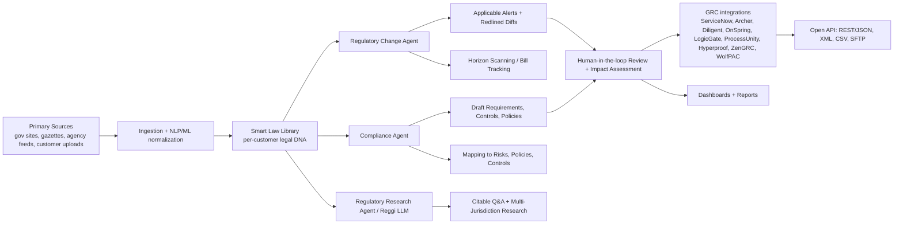

# Regology Research Report

> **Purpose.** A competitive/inspiration reference for the GLI Regulatory Change Monitoring POC. The authoritative scope and feature catalog live in [`refined_client_requirement.md`](refined_client_requirement.md); this report explains what Regology is, how it works, what it costs, and what GLI should consider building beyond the baseline POC to create durable business value.
>
> **Audience.** GLI compliance leadership and the engineering team building the Regulatory Change Monitor.
>
> **Last updated.** Sunday, May 10, 2026.

---

## Table of Contents

1. [Executive Summary](#1-executive-summary)
2. [Company & Product Overview](#2-company--product-overview)
3. [Pricing](#3-pricing)
4. [Underlying Technology & Architecture](#4-underlying-technology--architecture)
5. [Feature Catalog](#5-feature-catalog)
6. [How Each Feature Works — End-to-End Steps](#6-how-each-feature-works--end-to-end-steps)
7. [Gap Analysis: Regology vs the GLI POC](#7-gap-analysis-regology-vs-the-gli-poc)
8. [Suggested Extra Features for GLI](#8-suggested-extra-features-for-gli)
9. [Risks, Watch-Outs, and Recommendations](#9-risks-watch-outs-and-recommendations)
10. [References](#10-references)

---

## 1. Executive Summary

[Regology](https://www.regology.com/) is a regulatory intelligence SaaS platform that automates the full compliance lifecycle — detecting regulatory changes, summarizing them with citations, drafting downstream policy/control updates, and pushing approved changes into customers' systems of record. It is built on three AI Agents (Regulatory Change, Compliance, Regulatory Research) that all run against a proprietary "Smart Law Library™" containing 16M+ documents from 10,000+ data sources across 135+ countries. Regology is the closest commercial analog to what GLI is building in the Regulatory Change Monitoring POC, and serves as a strong reference architecture for the broader vision (POC → 800+ jurisdictions → cross-product chatbot).

**TL;DR for GLI engineering:**

- The closest analog to the GLI POC is Regology's **Regulatory Change Agent**: scheduled crawl → NLP-normalized diff → applicability filter against a per-customer "legal DNA" profile → redlined alert → human review → push to system of record. The POC's N8N + vector-diff approach matches the spine of this flow but is missing the applicability/relevance scoring layer and the redlined structural diff.
- The features most worth borrowing are: **(a)** redlined clause-level diffs (not just embedding similarity), **(b)** Reggi-style alert-relevance scoring before items reach the reviewer, **(c)** auto-drafted "downstream update package" (Regology drafts requirement/control/policy edits; GLI's analog is GLIAccess certification requirements, submission templates, and test criteria), and **(d)** mandatory citations on every AI output.
- Regology's pricing — **$1,700/user/month (Professional, 3-year contract)** with Enterprise quoted custom — is high enough to justify GLI building its own purpose-built tool for gaming, especially since gaming-specific terminology, GLI standards (GLI-11/13/19), and product taxonomy (Lottery, iLottery, iGaming, VLT, Hoppers) are not what Regology optimizes for.

**What this report is not.** A purchase recommendation. Regology is a reference; GLI's POC is the primary deliverable. The "Suggested Extra Features" section translates Regology's most useful ideas into concrete, GLI-specific working steps the team can implement.

---

## 2. Company & Product Overview

- **Founded.** 2017. Headquartered at 437 California Ave, Palo Alto, CA 94306. Phone: (844) 311-7347. Source: [Regology landing page](https://www.regology.com/) and [Tooliverse 2026 review](https://tooliverse.ai/tools/regology).
- **Mission positioning.** "Industry-agnostic global regulatory intelligence platform" — explicitly markets itself as not vertical-locked, in contrast to Westlaw/LexisNexis (deep legal research) and verticalized tools like Smartria/ComplySci.
- **Scale claims (from the landing page).**
  - **10,000+** data sources worldwide.
  - **135+** countries in the global database of laws.
  - **16M+** documents searchable on the Enterprise tier.
  - "100% applicable laws identified on our platform" — a marketing claim, not independently verified.
- **Industries served.** Banking & Financial Institutions, Crypto & Digital Assets, Energy & Utilities, **Gaming & Sports Betting**, Government & Regulatory Authorities, Healthcare & Life Sciences, Manufacturing, Software & Technology.
- **Regulatory topics covered.** AML & BSA, ESG, Labor & HR, Money Transmitter, Privacy & Information Security, Tax — plus customer-defined topics on Enterprise.
- **Reference customers shown publicly.** KeyBank and ServiceNow logos appear on the landing page; ProcessUnity is shown in the Reggi screenshot. The [Tooliverse 2026 review](https://tooliverse.ai/tools/regology) corroborates these and notes Diligent as both an integration partner and a reseller-style channel ("through its Regology partnership").
- **Maturity signals.** SOC 2 Type II audited (BARR Advisory). Funding history is publicly traceable through Crunchbase coverage referenced on the Regology blog.
- **Why this matters for GLI.** Regology has spent ~9 years productizing the exact "regulatory change → impact → propagate" loop that the GLI POC is starting at Phase 1. We don't need to reinvent the loop; we need to reproduce its essential mechanics for gaming with much less build cost.

---

## 3. Pricing

Regology publishes a three-tier pricing model on its [public pricing page](https://www.regology.com/pricing). Two of the three tiers have a transparent price point; the third is enterprise-quoted.

### 3.1 Tier overview

| Tier | List price | Best for | Coverage |
| --- | --- | --- | --- |
| **Reggi (Free)** | $0 | Individual analysts evaluating GenAI for compliance research | US laws & regulations only; Reggi assistant only |
| **Professional** | **$1,700 / user / month** with a **3-year contract** | Compliance teams that need US-only change management with the full Smart Law Library | US Federal + all 50 states |
| **Enterprise** | Custom (contact sales) | Multi-jurisdictional, GRC-integrated programs that need compliance management on top of change management | Global; 135+ countries; 16M+ documents searchable |

The $1,700/user/month figure for Professional is confirmed by the [Tooliverse 2026 review](https://tooliverse.ai/tools/regology). One third-party comparison ([SmartSuite](https://tooliverse.ai/tools/regology) on Dec 7, 2025) cites $1,250/user/month, suggesting some negotiation room or older pricing — but the canonical published number is $1,700.

### 3.2 What's included at each tier

**Reggi (Free).**

- Individual access to Reggi, Regology's GenAI assistant.
- Summarize and simplify regulatory text.
- Query US laws and regulations.
- Verifiable citations on every response.
- _Not included:_ Smart Law Library, alerts, change management, dashboards.

**Professional ($1,700/user/month, 3-year contract).**

- Smart Law Library (US-only).
- Regulatory Change Management — alerts and impact assessments.
- Reggi scoped to your Smart Law Library and change alerts.
- US Federal + all 50 states content.
- Search within all US content.
- Dashboards and reporting.
- In-app access to support.
- _Not included:_ Global jurisdictions, customizable topics, Bills tracking, GRC integrations, compliance management (risks/policies/controls), 24/7 IT support, custom API.

**Enterprise (custom).**

- Everything in Professional, plus:
- Scalable user pricing (negotiated, not pure per-seat).
- Global jurisdictions (135+ countries).
- Bills, regulatory changes, and agency updates.
- Customizable regulatory topics.
- Search across 16M+ documents.
- Group workflows.
- Compliance management — risk, task, policy management, controls testing.
- GRC integrations: ServiceNow, Archer, Diligent, OnSpring, LogicGate, ProcessUnity, Hyperproof, ZenGRC, WolfPAC.
- Custom API integrations (REST/JSON, XML, CSV, SFTP).
- Customized legal research support.
- 24/7 cloud IT support.

### 3.3 Pricing watch-outs (from third-party reviews)

The [Tooliverse 2026 review](https://tooliverse.ai/tools/regology) and aggregated user feedback flag four recurring concerns:

- **High entry price.** $1,700/user/month with a 3-year contract is prohibitive for SMBs, and even mid-market teams report sticker shock. Mentioned in 5 verified reviews.
- **Imperfect non-GRC syncing.** Pushing updates to CRM/HR systems is reported as less reliable than to native GRC integrations. Mentioned in 4 reviews.
- **Decision-support, not decision-maker.** Reviewers note that human-in-the-loop validation is required; Regology does not autonomously approve regulatory changes. Mentioned in 3 reviews.
- **Niche / regional coverage gaps.** [Visualping's compliance guide (Feb 2026)](https://tooliverse.ai/tools/regology) notes Regology may "lag on niche or regional updates compared to curated databases" and is "not designed for deep legal research like Westlaw."

### 3.4 What this implies for GLI

- **Building vs buying.** For 800+ gaming jurisdictions and a long-term roadmap (cross-product chatbot, translation tool, GLIAccess sync), a per-seat license at this price point is unattractive. A purpose-built internal POC has a strong ROI argument from year one.
- **Enterprise-only features matter most to GLI.** The features GLI most needs (global jurisdictions, customizable topics, GRC-style integrations to GLIAccess/SharePoint, custom API) live in the Enterprise tier — i.e., the highest-cost tier with no published price.
- **Free Reggi as a benchmark.** Reggi's free tier gives the team a no-cost way to feel the UX bar (citation quality, summary depth, prompt patterns) before building the GLI equivalent.

---

## 4. Underlying Technology & Architecture

Regology does not publish a detailed architecture diagram, but enough is documented across the [Platform page](https://www.regology.com/platform), the [Reggi help docs](https://help.regology.com/rug/reggi), the [AI explainer blog post](https://www.regology.com/blog/regulatory-compliance-tech-and-artificial-intelligence-how-does-it-work), the [SOC 2 announcement](https://www.regology.com/blog/regology-successfully-maintains-soc-2-compliance), and verified third-party reviews to reconstruct the platform's high-level design.

### 4.1 High-level architecture

### 4.2 AI stack

- **NLP + ML core.** Per the [Regology blog on AI in compliance](https://www.regology.com/blog/regulatory-compliance-tech-and-artificial-intelligence-how-does-it-work), the platform uses Natural Language Processing and Machine Learning trained to "read the law the way a lawyer reads it" — section/clause structure recognition, definition extraction, requirement detection ("must"/"shall"), penalty extraction, exemption extraction, and cross-reference resolution.
- **Generative layer (Reggi).** A Large Language Model wraps the NLP/ML layer to expose generative skills (summarization, drafting, Q&A) with retrieval-augmented citations. Per the [Reggi help page](https://help.regology.com/rug/reggi), Reggi answers come "with cited references from both the Regology platform and trusted external sources."
- **Agentic orchestration.** Three specialist agents (Change, Compliance, Research) each coordinate retrieval + LLM calls + workflow actions. The [Tooliverse review](https://tooliverse.ai/tools/regology) describes this as a "high-precision AI agents" pattern that maps requirements to controls automatically.
- **Multi-page synthesis.** The blog states: _"if there is a multi-page update from regulatory bodies, the AI automatically synthesizes its contents so that users are able to easily understand what has changed compared to the original copy, what the new risks and control requirements are, as well as the enforcement actions associated with the regulation."_ This is an explicit description of clause-level diff + impact extraction, not generic embedding similarity.

### 4.3 Data layer — the "Smart Law Library™"

- **What it is.** A proprietary, per-customer law library that filters the global 16M+ document corpus down to the content applicable to that customer's "legal DNA" (jurisdictions, products, regulatory topics, business lines).
- **Granularity.** Paragraph-level breakdown with persistent citations, so every alert, requirement, control, and policy can be traced back to a specific clause.
- **Update model.** Continuous — new amendments are ingested and surfaced as redlined alerts against the prior version, not as full-document replacements.
- **Sources.** Per the [help docs on Application Configuration](https://help.regology.com/en/rug/p/application-configuration) and [Law Library help](https://help.regology.com/en/rug/p/law-library):
  - Official primary-source feeds (10,000+ data sources worldwide).
  - Customer uploads — PDF, doc, docx, txt — with required metadata: jurisdiction, topic, effective date.
  - Curation by Regology's in-house Legal Research team.
- **Why this matters for GLI.** This is the model GLI's POC needs to replicate: a customer-specific filtered view of a much larger corpus, with paragraph-level traceability so that any downstream artifact (a GLIAccess test criterion, a submission template) can be linked back to a specific clause of a specific regulation in a specific jurisdiction.

### 4.4 Integration layer

- **Open API formats.** REST/JSON, XML, CSV, SFTP — listed on the [Tooliverse review](https://tooliverse.ai/tools/regology) and corroborated by the Enterprise tier on the [pricing page](https://www.regology.com/pricing).
- **Direct GRC connectors.** ServiceNow, Archer (RSA Archer), Diligent, OnSpring, LogicGate, ProcessUnity, Hyperproof, ZenGRC, WolfPAC.
- **Datasheet evidence.** Regology publishes integration datasheets for [Onspring](https://www.regology.com/datasheets), ServiceNow, and a generic "Regology for GRC" datasheet, which suggests these are well-documented, supported integrations rather than ad-hoc connectors.
- **Custom integrations.** Available on Enterprise; the API supports "DIY connectors to homegrown GRC systems or other internal tools" per the Tooliverse review.

### 4.5 Security, privacy, and AI governance

- **SOC 2 Type II.** Audited by [BARR Advisory, P.A.](https://www.regology.com/blog/regology-successfully-maintains-soc-2-compliance), covering Security, Availability, Processing Integrity, Confidentiality, and Privacy.
- **Data privacy regulations.** Compliant with GDPR, CCPA, and various US state privacy laws per the [privacy policy](https://www.regology.com/privacy-policy).
- **No PCI storage.** Payment card data is not stored on Regology servers (per the Terms of Service).
- **Responsible AI Policy.** Published in the footer of [regology.com](https://www.regology.com/), signaling governance posture for GenAI usage.
- **Why this matters for GLI.** SOC 2 Type II + Responsible AI Policy is the table-stakes posture the GLI POC will need before it's allowed near GLIAccess production data. Plan for it from day one rather than retrofitting later.

### 4.6 Architectural lessons for GLI

1. **Separate the corpus from the customer view.** Don't store "Nevada regulations" once; store them once globally and project a per-customer (or per-product, per-jurisdiction) Smart Law Library on top.
2. **Diff at the clause level, not the document level.** Embedding similarity alone surfaces too much noise; structural section parsing is what makes Regology's redlines readable.
3. **Always cite.** Every AI output (summary, draft, alert, answer) carries an explicit citation back to a clause. Make this a non-negotiable in the GLI POC.
4. **Agents over monolith.** Separate Change, Research, and Compliance agents keep prompts focused, evaluation tractable, and incident scope contained.
5. **Open API first, GRC connectors second.** A clean REST/JSON + SFTP API surface is what allowed Regology to plug into nine different GRC vendors. The GLI equivalent should expose a clean internal API even if the first consumer is just SharePoint MCP.

---

## 5. Feature Catalog

This section answers **Question 5** ("What features are offered?"). Features are grouped exactly the way Regology organizes them on the [Platform page](https://www.regology.com/platform) and the [Pricing page](https://www.regology.com/pricing). Each feature has a one- or two-line description plus a "How it works" bullet so the mechanics are visible.

### 5.1 Smart Law Library™

The foundational data product — every other feature reads from it.

- **Flexibility.** Choose from pre-curated law libraries or import your own legal register. _How it works:_ pre-curated libraries are mapped to industry/jurisdiction profiles; imported libraries are uploaded as PDF/doc/docx/txt and parsed by the NLP layer into clauses + metadata.
- **Organization.** Group laws by topic, department, or product line. _How it works:_ tag-based organization with multi-dimensional filters; saved as part of the customer's "legal DNA."
- **Granular detail.** Paragraph-level breakdowns and citations. _How it works:_ each section is parsed into clauses; each clause has a stable citation ID used by alerts, drafts, and the Q&A agent.
- **GenAI summaries.** Auto-summarize laws or extract requirements. _How it works:_ Reggi runs over the clause corpus and emits a summary with inline clause-level citations.

### 5.2 Regulatory Change Agent

The closest feature to the GLI POC. Tracks bills, laws, regulations, and agency updates in real-time.

- **Applicable Alerts.** Filter alerts so only changes that affect the customer's legal DNA are surfaced. _How it works:_ each detected change is matched against the customer's jurisdiction/topic/product profile before being delivered.
- **Redlined Diffs.** Show exactly what changed in the regulation text. _How it works:_ section-aware structural diff produces inline redlines (insertions/deletions) at the clause level — not a full-document rewrite.
- **Impact Analysis.** Determine how the change impacts the customer and assign ownership. _How it works:_ AI-generated impact summary; reviewer can attach owners, due dates, severity.
- **Horizon Scanning / Bill Tracking.** Follow proposed bills from introduction to passage. _How it works:_ a separate Bills feed tracks legislative status changes; alerts can be configured to trigger at any milestone (introduced, committee, passed, signed).
- **Enforcement Actions tracking.** Monitor agency enforcement actions, penalties, restitutions. _How it works:_ separate feed scraped from agency enforcement publications; tagged to the relevant law and entity.
- **GenAI-powered Research on amendments.** Reggi can dive deeper into the amendment context. _How it works:_ Reggi is invoked from inside the alert review UI with the change context pre-loaded.

### 5.3 Compliance Agent

The "act on the change" layer.

- **Regulatory Mapping.** Connect compliance objects (risks, policies, controls) directly to the legislation that drives them. _How it works:_ explicit clause → control links stored as first-class objects; updates to the clause flag the control as needing review.
- **Drafting with GenAI.** Auto-draft requirements (obligations), control objectives, and policy statements from a regulation. _How it works:_ Reggi's "Draft Requirements / Controls / Policies" skills (see Reggi help docs) produce drafts with citations; user edits before saving.
- **GRC Integrations.** Push approved drafts into ServiceNow, Archer, Diligent, OnSpring, LogicGate, ProcessUnity, Hyperproof, ZenGRC, WolfPAC. _How it works:_ direct API connectors keep the Regology object in sync with the GRC system of record.
- **Task Management.** Assign tasks tied to a regulatory change or compliance object. _How it works:_ task records reference the underlying clause + control; status flows back to dashboards.
- **Controls Testing.** Test the effectiveness of controls. _How it works:_ test-plan + evidence storage tied to the control object; not deeply documented publicly but listed as Enterprise-tier feature.
- **Policy Gap Analysis.** AI compares internal policies and controls to source regulations. _How it works:_ Reggi reads the policy + the regulation, classifies each requirement as covered/missing/outdated/misaligned, and outputs a gap report.
- **Harmonized Requirements.** Group equivalent requirements across jurisdictions into a single source of truth. _How it works:_ AI clusters semantically similar requirements; user accepts/rejects clusters and the harmonized requirement is linked to all source clauses.

### 5.4 Regulatory Research Agent (Reggi)

The natural-language interface across the platform. The [Reggi help page](https://help.regology.com/rug/reggi) lists eight out-of-the-box skills and six agentic workflows.

**Out-of-the-box skills:**

- **Summarize a law or regulation** — Reggi auto-summarizes any document in the library and surfaces key info in a side panel.
- **Whom does the regulation apply to?** — extracts applicability scope.
- **What are the penalties of noncompliance?** — extracts penalty clauses.
- **What are the exemptions?** — extracts exemption clauses.
- **Draft Requirements** — drafts obligations for a given regulation.
- **Draft Controls** — drafts control objectives for a given regulation.
- **Draft Policies** — drafts policy statements for a given regulation.
- **Bill Research** — researches a single bill or bills in a year/jurisdiction/status (e.g., "Key requirements of Privacy bills in NY for 2024 that became law").
- **Relevance of a Regulatory Change Alert** — embedded into the alert review workflow, scoring whether an alert matters to the customer.

**Agentic workflows:**

- **Research a Single Authoritative Document** — open a doc, run a query or skill, see results in the right-side panel.
- **Multi-Jurisdictional Research** — pose a question across multiple jurisdictions; results are aggregated with per-jurisdiction citations.
- **Research Beyond the Law Library** — find regulations not yet in your library and add them as you go (library curation tool).
- **Research Documents in the Law Library** — restrict research strictly to your library to reduce noise.
- **Launch Research for a Specific Topic** — scope research to a curated topic (e.g., "AML & BSA").
- **Reggi as a Q&A Chatbot** — open the chat anywhere in the UI and ask questions in natural language.

### 5.5 AI-Powered Regulatory Search

- **GenAI-based Q&A.** Citable answers across 16M+ documents.
- **Broad Research.** Cross-jurisdictional search on one screen.
- **Enhanced Filtering.** Save and reuse advanced filters (jurisdiction, topic, date, document type, effective status).

### 5.6 Dashboards & Reporting

- **50+ pre-built dashboards.** Operational, executive, and team-level views.
- **Custom dashboards.** Drag-and-drop or query-based.
- **Download Reports.** PDF/Excel exports.
- **Automatically Email Reports.** Scheduled distributions.
- **Report at Company, Team, & Individual Levels.** Enterprise-only.

### 5.7 Onboarding (4-step model)

Documented on the [Regology landing page](https://www.regology.com/) as the standard rollout pattern.

1. **Set up a Smart Law Library™.** Choose pre-curated, or import your existing legal register from spreadsheets/static databases.
2. **Get direct access to regulatory intelligence.** Receive timely notifications and alerts; explore them with Reggi.
3. **Customize what's important.** Configure alert types and recipients within your organization.
4. **Expand when needed.** Add new jurisdictions/topics as the business grows; in-house Legal Research team assists with library maintenance.

### 5.8 Quick reference list (the "what features?" answer)

For Question 5 specifically, here is the canonical list, in plain bullets:

- Smart Law Library™ (pre-curated or imported, paragraph-level, GenAI summaries).
- Regulatory Change Agent (applicable alerts, redlined diffs, impact analysis).
- Bill Tracking & Horizon Scanning.
- Enforcement Actions tracking.
- Compliance Agent (regulatory mapping, GenAI drafting of requirements/controls/policies, task management, controls testing, policy gap analysis, harmonized requirements).
- Regulatory Research Agent (Reggi) with 8 out-of-the-box skills and 6 agentic workflows.
- AI-Powered Regulatory Search (cross-jurisdictional, citable, advanced filters).
- Customizable Dashboards & Reports (50+ pre-built).
- GRC Integrations (ServiceNow, Archer, Diligent, OnSpring, LogicGate, ProcessUnity, Hyperproof, ZenGRC, WolfPAC).
- Custom API Integrations (REST/JSON, XML, CSV, SFTP).
- Group Workflows (Enterprise).
- 4-step Onboarding with in-house Legal Research support.

---

## 6. How Each Feature Works — End-to-End Steps

This section answers **Question 6** ("How are those features working, list the steps?"). For each major feature group, the flow is laid out as a numbered, end-to-end sequence from trigger → outcome.

### 6.1 Regulatory Change Agent — full flow

The flagship workflow and the closest analog to the GLI POC.

1. **Source crawl.** Regology crawls 10,000+ primary sources (regulator websites, gazettes, agency feeds, official PDFs) on a configurable cadence per source.
2. **Normalization.** The NLP/ML layer parses the document into a clause tree (sections, sub-sections, paragraphs, definitions, requirements, penalties, exemptions). Stable IDs are assigned to each clause.
3. **Versioning.** The new clause tree is stored as a version of the document and compared structurally against the prior version.
4. **Structural diff.** A clause-level diff produces redlines — insertions/deletions/modifications at the paragraph level — preserving the legal structure rather than emitting a flat text diff.
5. **Applicability filter.** The change is matched against each customer's "legal DNA" (jurisdictions, topics, products). Customers whose profile matches receive an alert; others do not.
6. **Reggi alert-relevance scoring.** Per the [Reggi help docs](https://help.regology.com/rug/reggi), Reggi runs an "Relevance of a Regulatory Change Alert" skill embedded in the alert review workflow, scoring/contextualizing the change so reviewers can triage.
7. **Reviewer triage.** A human compliance reviewer opens the alert, sees the redline + Reggi context, and accepts/dismisses/forwards.
8. **Impact assessment workflow.** On accept, the reviewer launches an impact assessment: assigns owner, severity, due date, and links to affected risks/controls/policies.
9. **Downstream sync.** Approved updates flow to GRC (ServiceNow/Archer/etc.) via the integration layer; dashboards update automatically.
10. **Audit trail.** Every step (crawl, diff, alert, score, decision, sync) is logged and citable.

### 6.2 Bill Tracking & Horizon Scanning — flow

1. **Bill ingestion.** Bills from supported jurisdictions are ingested with metadata (number, sponsor, status, jurisdiction, year).
2. **Status tracking.** As the bill progresses (introduced → committee → passed → signed → effective), a status-change event is emitted.
3. **Applicability filter.** Bill is matched against customer profiles.
4. **Alert.** Customer receives a "horizon" alert with bill text, status, and sponsor.
5. **Reggi bill research.** User can run the "Bill Research" skill to summarize key requirements.
6. **Pre-emptive impact.** User can attach the bill to existing controls/policies as a watch item, so when it passes, the impact path is pre-mapped.

### 6.3 Reggi Q&A — flow

1. **User prompt.** User types a question in the Reggi chat (e.g., "What does NRS Chapter 463 say about independent testing laboratories?").
2. **Scope resolution.** Reggi determines the scope: full library, a single document, a specific topic, or cross-jurisdiction (depending on which entry point the user used — see the agentic workflows in §5.4).
3. **Retrieval.** Reggi retrieves relevant clauses from the Smart Law Library and, for some workflows, from trusted external sources.
4. **LLM synthesis.** The retrieved clauses are passed to the LLM, which generates an answer **with inline citations** to specific clause IDs.
5. **Verification surface.** Each citation is clickable; the user can land on the clause to verify the AI's claim.
6. **Save / reuse.** The answer can be saved into a research workspace, exported, or attached to a control/policy.

### 6.4 Reggi "Draft Requirements/Controls/Policies" — flow

1. **Select source.** User selects a law/regulation (or a clause within it) in the Smart Law Library.
2. **Run skill.** User clicks "Draft Requirements" (or Controls, or Policies).
3. **Generation with citations.** Reggi reads the source clauses and emits a structured draft (e.g., a list of obligations, each with a citation back to the source clause).
4. **Editorial pass.** User edits the draft inline.
5. **Save as compliance object.** User saves the result as a Requirement/Control/Policy object linked to the source clauses.
6. **Mapping.** The new compliance object is attached to risks, owners, tasks, and downstream control tests.
7. **GRC sync.** If GRC integration is enabled, the object is pushed to the system of record (ServiceNow/Archer/etc.) and kept in sync.

### 6.5 Policy Gap Analysis — flow

1. **Select inputs.** User selects (a) an internal policy or control and (b) the source regulation it should comply with.
2. **AI gap analysis.** Reggi compares the policy text against the regulation's clause tree and classifies each requirement as covered/missing/outdated/misaligned.
3. **Gap report.** A structured report is produced listing each requirement, its coverage status, and a citation to the source clause.
4. **Remediation tasks.** For each "missing" or "outdated" requirement, the user can spawn a remediation task with owner + due date.
5. **Re-run.** After remediation, the policy can be re-analyzed; the gap report is versioned so progress is auditable.

### 6.6 Multi-Jurisdictional Research — flow

1. **Open Research view.** User opens Research > Jurisdiction Research (per Reggi help docs).
2. **Pose query.** User enters a natural-language question and selects multiple jurisdictions; optionally selects a topic.
3. **Per-jurisdiction retrieval.** Reggi runs retrieval against each jurisdiction's slice of the Smart Law Library.
4. **Synthesis.** Reggi produces a comparative answer — what each jurisdiction requires, with explicit citations per jurisdiction.
5. **Side-by-side view.** Results are rendered as a comparison table (jurisdiction × requirement), so deltas are visible at a glance.
6. **Export.** The comparison can be exported or saved as a research artifact.

### 6.7 Onboarding — flow (the 4-step model in detail)

1. **Smart Law Library setup.** Choose a pre-curated library OR upload your existing legal register (spreadsheets, static DB exports). Regology parses, tags, and normalizes.
2. **Receive alerts.** Once the library is live, applicable change/bill alerts begin flowing automatically. Reggi is enabled scoped to your library.
3. **Customize alerts and recipients.** Configure which alert types go to whom (compliance team, legal, business owners). Set up dashboards.
4. **Expand.** Add jurisdictions, topics, or product lines over time. Regology's Legal Research team assists with library maintenance.

### 6.8 Why these flows matter for GLI

- The **Regulatory Change Agent flow (§6.1)** is the flow GLI is building. The POC's current N8N + vector-diff architecture covers steps 1–4 partially (crawl + embed-based diff) but does not yet have applicability filtering (step 5), AI relevance scoring (step 6), or structural redlines (step 4 in its proper form). These are exactly the additions called out in the [Suggested Extra Features](#8-suggested-extra-features-for-gli) section.
- The **Reggi Q&A and Drafting flows (§6.3, §6.4)** are the pattern for the Use-Case 3 chatbot in the GLI roadmap and for auto-drafting GLIAccess update packages.
- The **Multi-Jurisdictional Research flow (§6.6)** is the model for cross-jurisdiction comparison once GLI scales beyond the NV/NY POC.

---

## 7. Gap Analysis: Regology vs the GLI POC

This section maps each phase of the GLI Regulatory Change Monitoring POC (as scoped in [`refined_client_requirement.md`](refined_client_requirement.md)) to the equivalent mechanism inside Regology, then calls out the specific lessons to borrow. The goal is not parity with Regology — Regology has a 9-year head start and a much wider scope. The goal is to make sure the GLI POC absorbs the few patterns that take Regology from "regex on a webpage" to "production regulatory intelligence."

### 7.1 Phase 1 — Baseline document setup (NV + NY)

**GLI POC plan.** Download statutes & regulations from NGCB (Nevada) and gaming.ny.gov (New York). Create edited/modified versions to simulate regulatory changes; these form the diff-detection ground truth.

**Regology analog.** The Smart Law Library™ — but stored as a per-customer "legal DNA" view over a 16M+ document corpus, with paragraph-level clause IDs and metadata on each clause (jurisdiction, topic, effective date).

**Lessons to borrow.**

- **Parse, don't just download.** Persist regulations as a clause tree (chapter → section → paragraph → clause) with stable IDs, not as raw text blobs. This is what makes downstream redlines, citations, and impact mapping possible.
- **Metadata is mandatory at ingest.** Jurisdiction, topic (e.g., "licensing", "testing labs"), effective date, source URL, fetch timestamp, and source hash should be required at ingest time. Per the [Regology Application Configuration help](https://help.regology.com/en/rug/p/application-configuration), Regology requires this same metadata at upload.
- **Build the "GLI legal DNA" model now.** Instead of a flat list of regulations, store a profile per product type (Lottery, iLottery, iGaming, VLT, Hoppers) and per GLI standard (GLI-11, GLI-13, GLI-19) so that any regulation/clause can be matched to the products and standards it affects.

**Status.** GLI POC is well-aligned at the data acquisition step. The clause-tree + metadata + legal-DNA layer is a missing piece worth building before Phase 2 scales.

### 7.2 Phase 2 — Scheduler + scraper (N8N)

**GLI POC plan.** N8N workflow scrapes target URLs every 15–30 days, embeds scraped content as vectors, and compares against stored baseline embeddings to flag changed sections.

**Regology analog.** The Regulatory Change Agent's source crawl + NLP normalization + structural diff pipeline (steps 1–5 in §6.1).

**Lessons to borrow.**

- **Combine vector diff with structural diff.** Pure cosine similarity over chunk embeddings is good for "did anything roughly change?" but bad at telling reviewers _what_ changed in a way they can read. Regology emits redlines at the clause level — that is what the compliance team actually wants to see. GLI should pair vector retrieval with a clause-level structural diff (e.g., tree-edit-distance or a custom HTML/PDF section parser) so the UI can show inline insertions/deletions.
- **Treat sources as first-class objects with health metrics.** Regology runs against 10,000+ feeds; the only way to keep that working is to monitor each source for HTTP errors, structure changes, and stale content. The N8N flow should emit per-source health metrics (last successful fetch, hash drift, parse success rate) to a dashboard.
- **Idempotent ingest.** Each fetch should produce a versioned document with a stable hash and ID; re-running a scrape should not create duplicates. This is implicit in Regology's model and explicit in their version-tracking feature.
- **Schedule per source, not per pipeline.** Some regulators publish weekly, others quarterly. A single 15–30-day cadence is too coarse for high-velocity jurisdictions and wasteful for low-velocity ones. Move to per-source schedules.

**Status.** This is where the largest gap exists between the current POC architecture and the Regology bar. None of these are heavy lifts; all are achievable in N8N.

### 7.3 Phase 3 — Change detection & diff display (HITL UI)

**GLI POC plan.** Simple web UI: jurisdiction name, regulation section changed, previous text vs new text, detected-on date. Reviewer approves or dismisses each change.

**Regology analog.** Alert review UI with redlined diffs + Reggi alert-relevance scoring + impact assessment workflow (steps 4–8 in §6.1).

**Lessons to borrow.**

- **Add an AI-assist column to the UI.** Before a reviewer sees a change, an LLM should pre-classify it: relevance score (0–1), suggested impacted GLI standards, suggested impacted product types, plain-English summary. This is exactly what Reggi's "Relevance of a Regulatory Change Alert" skill does, embedded in the alert review workflow.
- **Track decisions for model improvement.** Every accept/dismiss is training data. Capture reviewer + reason (free-text and structured) so that over time the relevance scorer can be tuned to GLI's specific compliance priorities.
- **Make the UI show citations and diffs side-by-side.** Reviewers should never have to leave the UI to verify a change against the source — embed the source URL + a snapshot of the original page at fetch time.
- **Triage queues.** Group alerts by jurisdiction, by regulator, by product impact. A flat list of changes does not scale to 800 jurisdictions.

**Status.** The POC plan is correct in spirit but minimal. The reviewer UX is where Regology shines; this is the easiest place to differentiate the GLI tool from "a pile of diffs."

### 7.4 Phase 4 — SharePoint integration (MCP)

**GLI POC plan.** On approval, use SharePoint MCP tools to push updated regulatory content directly into the relevant SharePoint document/folder. Avoid building a custom API.

**Regology analog.** GRC integrations layer (ServiceNow, Archer, Diligent, OnSpring, LogicGate, ProcessUnity, Hyperproof, ZenGRC, WolfPAC) — the post-approval push of regulatory artifacts into the customer's system of record.

**Lessons to borrow.**

- **Idempotent sync layer with audit trail.** Each push to SharePoint should be retriable, idempotent, and logged. If SharePoint MCP fails mid-write, the system should know to retry without creating duplicates. Regology emphasizes "continuous syncing of legal obligations and compliance artifacts" — the implication is bidirectional state management, not fire-and-forget.
- **Don't push raw diffs — push update packages.** A SharePoint document is read by humans; pushing a redline is less useful than pushing a structured update package: "Regulation X changed at clause Y. Suggested edits to GLIAccess test criterion Z and submission template W are attached. Approver: Jane Doe. Effective date: 2026-09-01." This is the analog to Regology's auto-drafted compliance objects.
- **Approval state machine.** A change should flow: detected → relevance-scored → reviewed → approved → drafted → reviewed-again → pushed. Skipping the second review on auto-drafted content is a non-starter for a regulator-facing organization.

**Status.** SharePoint MCP is the right choice. The lesson is to layer a structured update-package abstraction on top of raw MCP calls, rather than pushing raw text changes.

### 7.5 Scale — 800+ jurisdictions + sales signals

**GLI POC plan.** Add remaining jurisdiction URLs. Optionally add a "new market entrant" node — scrape manufacturer/competitor sites and surface sales intelligence (e.g., Aristocrat entering iGaming). Treat as a modular agentic node.

**Regology analog.** Bill Tracking / Horizon Scanning + Enforcement Actions feed.

**Lessons to borrow.**

- **Horizon scanning is high-value at GLI's scale.** Tracking proposed bills/regulations before they pass means GLI can pre-position certification updates and warn operators in advance. Regology productizes this as a separate feed; GLI should consider it as a Phase 5 node.
- **Modularity is the right call.** The "sales-signal" node should be its own agent, with its own sources and its own digest, separate from the regulatory change pipeline. Regology's Enforcement Actions feed is structured the same way.
- **Differentiate "regulator" sources from "market" sources.** Manufacturer/competitor sites have different update cadences, different content structures, and different downstream consumers (sales vs compliance). They should not share the same pipeline as government sources.

**Status.** The POC's scale plan is sound. The horizon scanning idea is the high-leverage addition.

### 7.6 Cross-cutting deltas (everywhere)

These are gaps that apply across all phases:

- **Citations on every AI output.** Regology will not return an answer or a draft without an inline citation. The GLI tool should bake this in from day one.
- **SOC 2 / Responsible AI posture.** Regology is SOC 2 Type II + has a published Responsible AI Policy. GLI's tool will eventually need the same — design accordingly (audit logs, prompt logging, model version tracking, PII handling).
- **Multi-tenancy / multi-jurisdiction views.** Even within GLI, different teams care about different jurisdictions/products. Build the data model so that views can be projected without duplicating storage.

---

## 8. Suggested Extra Features for GLI

This section answers **Question 7** ("What extra features do you suggest that will create business value?") and **Question 8** ("List out the extra features with working ideas or steps?").

Each suggestion includes: **(a)** the business value, **(b)** how it would work as numbered steps, **(c)** suggested tools/components, and **(d)** an effort tier — **S** (small, ≤1 sprint), **M** (medium, 1–2 sprints), **L** (large, 3+ sprints).

The list is prioritized — the higher in the list, the higher the leverage on the existing POC.

### Priority summary

| # | Feature | Effort | Why it matters |
| --- | --- | --- | --- |
| 1 | Clause-level structural diff | M | Unblocks readable redlines; fixes vector-only diff noise |
| 2 | LLM alert-relevance scoring agent | M | Cuts reviewer load; the single biggest UX delta vs Regology |
| 3 | Auto-drafted GLIAccess update package | L | Closes the loop from "change detected" → "GLIAccess updated" |
| 4 | Standards-mapping graph (GLI-11/13/19) | M | Computes impact automatically; ties to Use-Case 3 chatbot |
| 5 | Horizon scanning / bill tracking node | M | Pre-positions certification updates before regulations pass |
| 6 | Multi-channel stakeholder notifications | S | Right info to the right person (staff/operators/regulators) |
| 7 | Audit trail & evidence locker | S | Regulator-grade auditability; near-zero ongoing cost |
| 8 | Multi-jurisdiction comparison view | M | Critical for scale to 800 jurisdictions |
| 9 | Localization / translation layer | M | Bridges Use-Case 1 with Use-Case 2 (translation tool) |
| 10 | Confidence + provenance dashboard | S | Operationalizes "always cite" + LLM hallucination control |
| 11 | Source-health monitor | S | Closes silent-failure risk in the N8N scraper |
| 12 | Sales-signal node (new market entrant) | M | Realizes the optional Phase-5 opportunity |

### 8.1 Clause-level structural diff (effort: M)

**Business value.** Reviewers can _read_ the change in seconds instead of comparing two text blobs. This is the single feature that makes the difference between a demo and a daily-use tool.

**How it works.**

1. Parse each fetched regulation into a clause tree (chapter → section → paragraph → clause) using a regulator-specific or generic HTML/PDF parser.
2. Persist each clause with a stable ID, a hash, and metadata (jurisdiction, citation, effective date).
3. On each fetch, compare the new clause tree against the prior version using a structural diff (e.g., tree-edit distance) at the clause level.
4. Emit a `ChangeEvent` per modified/added/removed clause with old text, new text, and the structural relationship (insertion, deletion, replacement).
5. Render redlines inline in the reviewer UI using a side-by-side or inline diff component.

**Suggested tools.** `unstructured` or `pdfplumber` for PDFs, `BeautifulSoup` for HTML, `python-tree-sitter` or a custom recursive diff for the tree compare, `diff-match-patch` for inline word-level redlines inside changed clauses.

### 8.2 LLM alert-relevance scoring agent (effort: M)

**Business value.** Most detected changes are not material to GLI. A scoring agent collapses the reviewer queue from "every change" to "changes that probably matter," which is the single biggest day-to-day workload delta.

**How it works.**

1. For each `ChangeEvent`, build a prompt that includes: the changed clause text, the citation, the impacted product types, and the GLI standards potentially affected.
2. Call a small/cheap LLM (e.g., `gpt-4o-mini`, Claude Haiku, or a self-hosted model) with structured output: `{relevance_score: 0–1, impacted_standards: [...], impacted_products: [...], plain_summary: "..."}`.
3. Persist the score alongside the `ChangeEvent`.
4. In the reviewer UI, sort by relevance descending; pre-fill the impacted standards/products columns; show the plain-English summary.
5. Capture reviewer accept/dismiss + reason as labels for future fine-tuning.
6. Run a weekly job to compare scorer predictions against reviewer decisions and emit a quality metric.

**Suggested tools.** OpenAI/Anthropic API or a self-hosted Llama 3.1 8B-instruct, Pydantic for structured output, a small SQLite/Postgres table for labels.

### 8.3 Auto-drafted GLIAccess update package (effort: L)

**Business value.** The POC currently stops at "approved change pushed to SharePoint." The real workflow continues: certification requirements, submission templates, documentation, and test criteria need to be updated. Auto-drafting these updates is what makes the system actually save compliance team hours.

**How it works.**

1. On reviewer approval of a `ChangeEvent`, look up the affected GLIAccess artifacts via the standards-mapping graph (§8.4) — e.g., "GLI-11 §6.2 test criterion T-141, submission template ST-7."
2. For each affected artifact, retrieve its current text from SharePoint (via MCP).
3. Run a "Draft Update" LLM call: input = (current artifact text + changed clause + plain-English summary); output = (suggested edits with citations + rationale).
4. Render the proposed update in the reviewer UI as a redline against the current artifact.
5. On second-stage approval, push the updated artifact to SharePoint via MCP, with an audit-trail entry.
6. Notify the artifact owner (per the standards-mapping graph) by email/Slack.

**Suggested tools.** Same LLM stack as §8.2; SharePoint MCP for read/write; a templating layer that knows the structure of test criteria, submission templates, etc.

### 8.4 Standards-mapping graph: clauses ↔ GLI standards ↔ products (effort: M)

**Business value.** Without this graph, every "what does this change affect?" question is a manual exercise. With it, impact is computed automatically and is consistent across the change monitor and the Use-Case 3 chatbot.

**How it works.**

1. Define three node types: `RegulatoryClause` (jurisdiction, citation), `GLIStandardSection` (e.g., GLI-11 §6.2), `ProductType` (Lottery, iLottery, iGaming, VLT, Hoppers).
2. Define edges: clause → standard-section, standard-section → product-type, clause → product-type (direct, when known).
3. Seed the graph from existing GLI documentation; expose a UI for compliance experts to add/edit edges.
4. When a `ChangeEvent` is created, traverse the graph from the changed clause to find affected standards and products.
5. Surface the traversal results in the reviewer UI and feed them to the alert-relevance scorer (§8.2) and the update drafter (§8.3).
6. Use the same graph as the retrieval layer for the Use-Case 3 chatbot ("I'm testing a 2-level progressive game with bonuses for Nevada — what should I do?").

**Suggested tools.** Neo4j or a Postgres-backed graph (using `pg_trgm` + recursive CTEs), or a plain JSON file for v1 if the graph is small. A simple Streamlit/React editor for compliance staff.

### 8.5 Horizon scanning / bill tracking node (effort: M)

**Business value.** Catching a bill at "introduced" instead of "effective" gives GLI months of lead time to update standards, train staff, and warn operators. Regology productizes this; GLI should have it as a Phase 5 node.

**How it works.**

1. Identify per-jurisdiction bill listing pages (NV Legislature, NY State Senate, Australian state parliaments, etc.).
2. Add a separate N8N pipeline that scrapes bill listings on a faster cadence (e.g., daily) and tracks status changes.
3. For each new or status-changed bill, run a relevance check against the legal-DNA / standards-mapping graph.
4. Emit a `BillEvent` to a separate "Horizon" queue (different from the regulation-change queue).
5. Reviewer dashboard shows bills by status: introduced / committee / passed / signed / effective.
6. When a bill is signed/effective, automatically link it to a `RegulatoryChangeEvent` so the watch-list converts to a tracked change.

**Suggested tools.** N8N orchestrator (per the POC stack in [`poc_low_level_architecture.md`](poc_low_level_architecture.md) §1); same LLM stack as §8.2; a `bills` table with status history.

### 8.6 Multi-channel stakeholder notifications with role templates (effort: S)

**Business value.** A change matters differently to GLI staff (act on it), operators (be informed), and regulators (acknowledge receipt). One-size-fits-all email blasts get ignored.

**How it works.**

1. Define notification channels: email, Slack, MS Teams, SharePoint announcement, webhook.
2. Define recipient roles: GLI staff (per product), operators (per jurisdiction), regulators (per jurisdiction).
3. Define per-role templates with different content depth and tone (technical / business / formal).
4. On change approval, pick the relevant recipients and channels via a configurable rule engine.
5. Support digest mode: instead of per-change notifications, group changes per recipient into daily/weekly digests with severity-based ordering.
6. Track delivery + opens/clicks per recipient for compliance evidence.

**Suggested tools.** N8N (it has Slack, Teams, email, webhook nodes built in); a small `notification_rules` and `notification_log` table.

### 8.7 Audit trail & evidence locker (effort: S)

**Business value.** A regulator-facing tool that cannot prove "what was decided, when, by whom, based on what evidence" is dead on arrival. This is also the foundation for SOC 2 readiness.

**How it works.**

1. Define an `AuditEvent` log: actor, action, target, timestamp, content hash, source URL snapshot, prior state hash, new state hash.
2. Emit `AuditEvent`s from every step: ingest, diff, score, review decision, draft, push to SharePoint, notification sent.
3. Append-only storage (e.g., Postgres with row-level immutability triggers, or an object store with WORM mode).
4. For each fetched regulation, also store a snapshot (HTML/PDF) at fetch time with its hash, so future audits can verify the system saw what it claims it saw.
5. Provide an export endpoint: "Show me everything the system did related to NRS Chapter 463 between dates X and Y."

**Suggested tools.** Postgres with `pgcrypto` for hashing; S3-compatible object storage for snapshots; a small read-only audit UI.

### 8.8 Multi-jurisdiction comparison view (effort: M)

**Business value.** Once GLI is tracking 800 jurisdictions, side-by-side comparison ("How does NV vs NY vs AU treat independent testing labs?") becomes the highest-frequency staff question. This mirrors Regology's "Multi-Jurisdictional Research" workflow.

**How it works.**

1. Build a comparison page: user picks a topic (e.g., "independent testing laboratories") + selects N jurisdictions.
2. For each jurisdiction, retrieve the matching clauses from the legal-DNA store (filtered by topic via the standards-mapping graph).
3. Run an LLM that produces a normalized side-by-side comparison: jurisdiction × requirement matrix, with each cell citing a specific clause.
4. Render the matrix in the UI; allow exporting to CSV/PDF.
5. Save comparisons as named "comparison reports" so they can be re-run when any input clause changes.
6. When a saved comparison's underlying clause changes, notify the owner.

**Suggested tools.** Same LLM stack; a `comparison_report` table with input parameters; a React table with column pinning.

### 8.9 Localization / translation layer (effort: M)

**Business value.** Regulators in non-English jurisdictions exist; operators in non-English markets exist; GLI's Use-Case 2 already plans a translation tool. Wiring the change monitor to that layer means a single approved change can be auto-translated for all stakeholders, with gaming terminology preserved.

**How it works.**

1. When a `ChangeEvent` is approved, mark "translation needed" if any of its target stakeholders are in a non-English locale.
2. Pull the gaming-specific data dictionary built in Use-Case 2 (game names, scores, signatures — all preserved as-is).
3. Translate the plain-English summary, the proposed update package (§8.3), and the operator-facing notification (§8.6) using an LLM with the data dictionary as context.
4. Tag each translated artifact with source language, target language, translator (model + version), and dictionary version.
5. Route translations through a HITL review for high-severity changes; low-severity can flow auto-approved.
6. Cache translations keyed by (source-text-hash, dictionary-version, target-language) so repeated content is not re-translated.

**Suggested tools.** Same LLM stack with prompt templates that include the data dictionary; a `translations` cache table.

### 8.10 Confidence + provenance dashboard (effort: S)

**Business value.** Reviewers need to trust the AI before they can act on it. Showing confidence + provenance per output is what makes "AI-assisted" feel like "AI-assisted" rather than "AI is making decisions."

**How it works.**

1. For every AI-generated artifact (summary, relevance score, draft, comparison), store: model + version, prompt template + version, retrieval IDs (which clauses were retrieved), confidence (model logprob, self-consistency vote, or rule-based score), and timestamp.
2. In the UI, show a small badge on every AI output with confidence + a "verify" button.
3. Clicking "verify" opens a panel with the retrieved clauses and the prompt actually used.
4. Provide a global dashboard: average confidence per artifact type, low-confidence outliers, % of AI outputs accepted vs revised vs rejected by reviewers.
5. Use the dashboard to prioritize prompt/model improvements.

**Suggested tools.** OpenTelemetry-style tracing for the LLM calls; a `llm_runs` table; Grafana or a small Streamlit dashboard.

### 8.11 Source-health monitor (effort: S)

**Business value.** The N8N scraper will silently break — regulators redesign their websites, change PDF formats, move URLs. Without monitoring, GLI will discover the failure only when a missed change becomes an audit finding.

**How it works.**

1. Per source, track: last successful fetch timestamp, HTTP status code, response size, parse success rate (clauses extracted / clauses expected), and content hash.
2. Define alerting thresholds: e.g., "no successful fetch in 2× expected cadence" → page on-call; "parse success rate < 95%" → ticket; "content hash unchanged for 12 months" → manual sanity check.
3. Render a source-health dashboard: green/yellow/red per source.
4. On red, snapshot the last good response and store the failing response side-by-side for debugging.
5. Run a weekly "rotting URLs" job: HEAD-check every source URL and flag 4xx/5xx responses.

**Suggested tools.** Existing N8N; a `source_health` table; Grafana or built-in N8N dashboards.

### 8.12 Sales-signal node — new market entrant (effort: M)

**Business value.** A roadmap/upside extension beyond the POC scope captured in [`refined_client_requirement.md`](refined_client_requirement.md) §10. Realizes the upside use case: detect when manufacturers/competitors enter new markets (e.g., "Aristocrat entering iGaming") and surface as sales intelligence — completely separate from the regulatory pipeline.

**How it works.**

1. Maintain a list of manufacturer/competitor sites + relevant news/press-release feeds.
2. Run a separate scraper (or N8N workflow) that fetches these on a daily cadence.
3. For each fetched item, run a classification LLM: is this a market-entry signal? Which company? Which jurisdiction? Which product type?
4. Emit `SalesSignalEvent` records to a separate queue.
5. Render a sales-intelligence dashboard scoped to a sales/business-development team (different audience than compliance).
6. Allow GLI sales staff to mark signals as actioned; track conversion to new client engagements.

**Suggested tools.** N8N orchestrator (per the POC stack in [`poc_low_level_architecture.md`](poc_low_level_architecture.md) §1); same LLM stack; RSS feed parsers; a `sales_signal` table.

---

## 9. Risks, Watch-Outs, and Recommendations

### 9.1 Risks borrowed from Regology's own watch-outs

These are the issues third-party reviewers flag about Regology that GLI should pre-empt in its own build:

- **Human-in-the-loop is non-negotiable.** Regology is explicitly a decision-support tool, not a decision-maker. The GLI POC already plans HITL — keep it firm even when leadership pushes for "auto-publish to SharePoint." Mistaken auto-publish to a regulator-facing artifact is a far bigger risk than slow review.
- **Per-user pricing scales poorly.** If/when GLI productizes, push for a workspace/team license model rather than per-seat — both internally and if the tool is ever offered to operators.
- **Non-GRC system syncs are fragile.** Regology's reviewers complain about CRM/HR sync. SharePoint MCP will have its own quirks; design for retries, idempotency, and monitoring from the start.
- **Niche/regional coverage gaps.** Regology can lag on niche jurisdictions; GLI's POC will face the same problem at 800 jurisdictions. Source-health monitoring (§8.11) is the answer.
- **Vector-only similarity is not enough.** Pure embedding diff produces noisy alerts and cannot render readable redlines. Pair vector retrieval with structural diff (§8.1).

### 9.2 GLI-specific risks

- **Regulator pushback on AI in compliance.** Some regulators may be uneasy with AI-assisted compliance updates. Mitigate by: (a) mandatory citations on every AI output, (b) HITL approval gates, (c) full audit trail (§8.7), and (d) a published Responsible AI position for GLI's tool.
- **Source structure changes.** Regulator websites are not stable APIs. Source-health monitoring (§8.11) and per-source parsers are the mitigation.
- **LLM hallucination.** Reggi's pattern of mandatory citations + retrieval-grounded answers is the right benchmark. Confidence + provenance dashboards (§8.10) operationalize it.
- **Scope creep into Use-Case 2 and Use-Case 3.** Each is its own product. Build clean interfaces (the standards-mapping graph, the data dictionary) so the change monitor can be a consumer/provider without merging codebases.
- **Data privacy / cross-border content.** Some jurisdiction content may carry redistribution restrictions. Track source license/terms at ingest as part of the metadata.
- **POC → production transition.** N8N is excellent for prototyping but has operational limits at 800 jurisdictions. Plan a checkpoint to evaluate moving the heavy pipeline to a more durable runtime (Airflow, Temporal, or a managed alternative) once the source count exceeds ~50 and the cadence requirements diversify.

### 9.3 Recommended next steps for the GLI team

In rough chronological order:

1. **Finish Phase 1 with proper structure.** Parse NV + NY regulations into a clause tree with stable IDs and metadata. Don't store raw text only.
2. **Stand up the standards-mapping graph (§8.4) skeleton.** Even an empty graph with a UI for compliance staff is enough to start.
3. **Add structural diff (§8.1) alongside the vector diff** so the reviewer UI can show readable redlines from day one.
4. **Add the LLM relevance-scoring agent (§8.2)** — this is the single highest-leverage addition.
5. **Bake in citations + audit trail (§8.7, §8.10)** before the tool sees its first real user.
6. **Add source-health monitoring (§8.11)** before scaling beyond NV + NY.
7. **Plan SOC 2 / Responsible AI posture** before any GLIAccess production push.
8. **Add horizon scanning (§8.5)** as the Phase 5 differentiator.

### 9.4 What success looks like

- Reviewer queue reduced by ≥70% via relevance scoring (vs naive "every diff" approach).
- 100% of AI outputs carry a citation that resolves to a specific clause in the source document.
- 0 silent scraper failures in any 30-day window (every failure surfaces in the source-health dashboard).
- Time from "regulation change published" to "GLIAccess artifact updated and stakeholders notified" drops from days/weeks (current manual baseline) to hours (target).
- Audit trail can answer "what did the system do related to NRS Chapter 463 between dates X and Y?" in <30 seconds.

---

## 10. References

### Regology — primary sources

- [Regology landing page](https://www.regology.com/) — scale claims, customer logos, agent overview, onboarding model.
- [Regology Platform page](https://www.regology.com/platform) — Smart Law Library, Regulatory Change & Horizon Scanning, AI Search, Compliance Objects, Dashboards.
- [Regology Pricing page](https://www.regology.com/pricing) — three-tier pricing, full Professional vs Enterprise feature comparison, FAQ.
- [Regology Datasheets index](https://www.regology.com/datasheets) — datasheets for Compliance Agent, Regulatory Research Agent, Regulatory Change Agent, Reggi, Onspring integration, ServiceNow integration, generic GRC, Banking & Financial Services, Regology Overview.
- [Regology blog: Regulatory Compliance Tech and AI — How Does It Work?](https://www.regology.com/blog/regulatory-compliance-tech-and-artificial-intelligence-how-does-it-work) — NLP + ML approach, multi-page synthesis claim.
- [Regology blog: SOC 2 compliance announcement](https://www.regology.com/blog/regology-successfully-maintains-soc-2-compliance) — SOC 2 Type II audit by BARR Advisory, scope (Security, Availability, Processing Integrity, Confidentiality, Privacy).
- [Regology Privacy Policy](https://www.regology.com/privacy-policy) — GDPR/CCPA posture.
- [Regology Terms of Service](https://www.regology.com/terms-of-service) — payment data handling.

### Regology — help and product documentation

- [Reggi help page](https://help.regology.com/rug/reggi) — out-of-the-box skills (8) and agentic workflows (6).
- [Application Configuration help](https://help.regology.com/en/rug/p/application-configuration) — custom data upload (PDF/doc/docx/txt + metadata).
- [Law Library help](https://help.regology.com/en/rug/p/law-library) — ingestion model and curation options.

### Third-party reviews and analysis

- [Tooliverse Regology Review 2026](https://tooliverse.ai/tools/regology) — verified pricing ($1,700/user/month), integrations list, watch-outs, user reviews, security & compliance summary.
- SmartSuite review (Dec 2025) — alternate pricing reference ($1,250/user/month) cited within the Tooliverse aggregation.
- Visualping Compliance Guide (Feb 2026) — niche/regional coverage gap commentary, cited within the Tooliverse aggregation.
- Diligent Editorial Team (Feb 2026) — partnership reference, cited within the Tooliverse aggregation.

### GLI POC source documents (workspace root: `research/`)

- [`refined_client_requirement.md`](refined_client_requirement.md) — authoritative POC scope, feature catalog, Day 1–3 plan, demo script, and roadmap (supersedes earlier scope briefs).
- [`refined_client_requirement_features.csv`](refined_client_requirement_features.csv) — sortable feature catalog aligned with the markdown.
- [`poc_low_level_architecture.md`](poc_low_level_architecture.md) and [`poc_low_level_architecture.csv`](poc_low_level_architecture.csv) — low-level technical blueprint and component inventory.
- [`migrations/001_init.sql`](migrations/001_init.sql) — canonical SQLite schema for the POC state + audit tables.

### Saved local research artifacts

- `/home/abhishek-kumar/.cursor/projects/home-abhishek-kumar-Documents-RnD-n8n-diff/uploads/www.regology.com-0.md` — captured Regology landing page used as the seed document.
- `agent-tools/fa9b58af-330d-4f11-ab1e-bc11ad38001f.txt` — full Tooliverse 2026 review captured during research.
- `agent-tools/9c4803c2-f3bc-4785-944d-b0798c894a8f.txt` — Regology Terms of Service captured during research.
- `agent-tools/37ad3a8d-730e-4180-a959-ad43c3785843.txt` — Regology Privacy Policy captured during research.

---

**End of report.**

